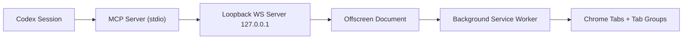

# Architecture

## Design Summary

`umbra` uses an MV3 extension plus a local MCP server. The MCP server is the Codex-facing surface. The extension is the Chrome-facing surface. They meet only over an authenticated loopback WebSocket.

## Components

- Codex session
  - calls standard MCP tools over stdio
- local MCP server
  - exposes the V1 browser tool surface
  - starts a loopback bridge listener for its own session
  - tracks the authenticated extension connection
- offscreen document
  - keeps long-lived WebSocket connections alive for active sessions
  - reconnects after network or worker churn
- background service worker
  - owns tab creation, grouping, navigation, and DOM interaction
  - enforces session ownership checks
- popup
  - shows bridge status
  - stores the shared install key and loopback scan range

## Flow

## Why Offscreen + Background

- The offscreen document is better at keeping WebSocket connections alive than the service worker alone.
- The background worker is the right place for tab and extension API access.
- Ownership data is persisted so worker suspend/resume does not silently drop isolation guarantees.

## Session Ownership Model

- Each session gets a unique `sessionId`.
- Each session gets one Chrome tab group.
- Each tab owned by the session is mapped to that `sessionId`.
- Every action first checks ownership before touching the tab.

This means:

- `browser_list_tabs` shows only session tabs
- one session cannot close another session's tab
- one session cannot switch to or inspect another session's tab

## DOM Interaction Strategy

V1 prefers `chrome.scripting.executeScript` over persistent content scripts.

Benefits:

- fewer moving parts
- no always-on all-page logic
- easier to audit action-by-action

Tradeoff:

- broad host permissions are still likely required for arbitrary browsing

## Screenshot Strategy

Opening, navigating, and DOM interaction tools are background-first: `browser_create_tab`, `browser_navigate`, `browser_click`, `browser_click_text`, `browser_fill`, `browser_press_key`, and `browser_scroll` default to inactive tabs so CiC can work without pulling Chrome to the foreground. Background CiC does not reuse the remembered dedicated window when that window is currently focused; it creates a fresh unfocused CiC window instead of adding tabs to Robert's active Chrome window. Explicit `browser_switch_tab`, `activate: true`, and screenshot capture are the foreground-sensitive paths.

At task completion, CiC cleanup is ownership-based: `browser_close_session_tabs` closes only the current session's tabs. It closes a whole window only when every tab in that window is owned by the session, preserving unowned tabs even when they are blank. Clean MCP shutdown calls the same cleanup by default, with `UMBRA_KEEP_TABS_OPEN=1` reserved for debug or inspection runs.

Two paths are possible:

1. A no-debugger path using visible-tab capture
   - simpler
   - may activate a session tab

2. A debugger-based path for less focus stealing
   - better UX if it avoids tab activation
   - needs a tighter permission and prompt review

The scaffold keeps this decision explicit instead of hiding it.
